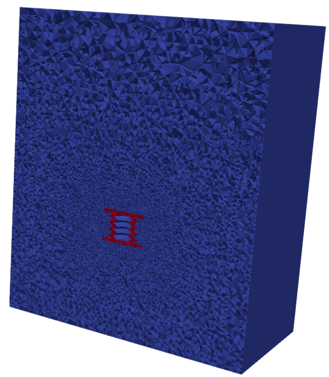

## Meshing an arbitrary 3D scattering object by using the Gmsh API.

This repository tends to be a tutorial about how to proceed when a scattering object inside a physical domain and surrounded by a PML should be meshed. This tutorial tends to follow [INRIA](https://project.inria.fr/softrobot/documentation/from-design-to-mesh-generation-using-freecad-and-gmsh/) tutorial but using the Gmsh API instead Gmsh GUI. The CAD geometry has been generated using FreeCAD and can be downloaded from [here](https://numseahy.udc.es/index.php/s/crPc8bmfaEPAsoF).


<p align="center">
   
</p>


### How to run
```julia
include("src/Mesh.jl")
```

### Authors
This work has been carried out by Andres Prieto Aneiros (andres.prieto@udc.es) and Pablo Rubial Yáñez (p.rubialy@udc.es) during the work developed in the [NumSeaHy](https://dm.udc.es/m2nica/en/node/157) project.


### License
 <p xmlns:cc="http://creativecommons.org/ns#" >This work is licensed under <a href="http://creativecommons.org/licenses/by/4.0/?ref=chooser-v1" target="_blank" rel="license noopener noreferrer" style="display:inline-block;">CC BY 4.0</a></p> 

