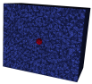

## Benchmark 1

This benchmark tends to check the capablities of Gridap to solve a 3D open-domain acoustic problem by solving a test which its analytical solution is known. The problem solved consists in a monopole emiting sound waves in a 3D space, where the generated field has been evaluated on the trace of a sphere and imposed as a boundary condition having in this way an equivalent problem.

<p align="center">
   
</p>

In this benchmark, the PML domain has been generated via software i.e there are not a physical domain generated during the meshing which isolates the physical domain from the PML domain. The traditional displacement-based PML formulation has been compared again with the novel one developed in the NumSeaHy project and it continues without return precise results, at least under Gridap solver. This benchmark is not fair enough to perform a convergence analysis of the numerical method because each time that a refinement Gmsh alogrithm is applied, the surface of the sphere is not refined and the mesh size $h$ is not exatly halved in each refinement.


The `Mesh.jl` file has inside a `FunMesh` function the let generate meshes with different number of elements `N` per wavelength and then save the generated meshes into the `data` folder. The `Run.jl` file has inside the `RunFEM` function that takes as input the mesh name and run the finite element simulation by using Gridap.

### How to run

To run the solver with the novel PML formulation:

```julia
include("src/Run.jl")
```

and to run the solver with the traditional PML formulation

```julia
include("src/RunOldFormulation.jl")
```

### Authors
This work has been carried out by Andres Prieto Aneiros (andres.prieto@udc.es) and Pablo Rubial Yáñez (p.rubialy@udc.es) during the work developed in the [NumSeaHy](https://dm.udc.es/m2nica/en/node/157) project.


### License
 <p xmlns:cc="http://creativecommons.org/ns#" >This work is licensed under <a href="http://creativecommons.org/licenses/by/4.0/?ref=chooser-v1" target="_blank" rel="license noopener noreferrer" style="display:inline-block;">CC BY 4.0</a></p> 

