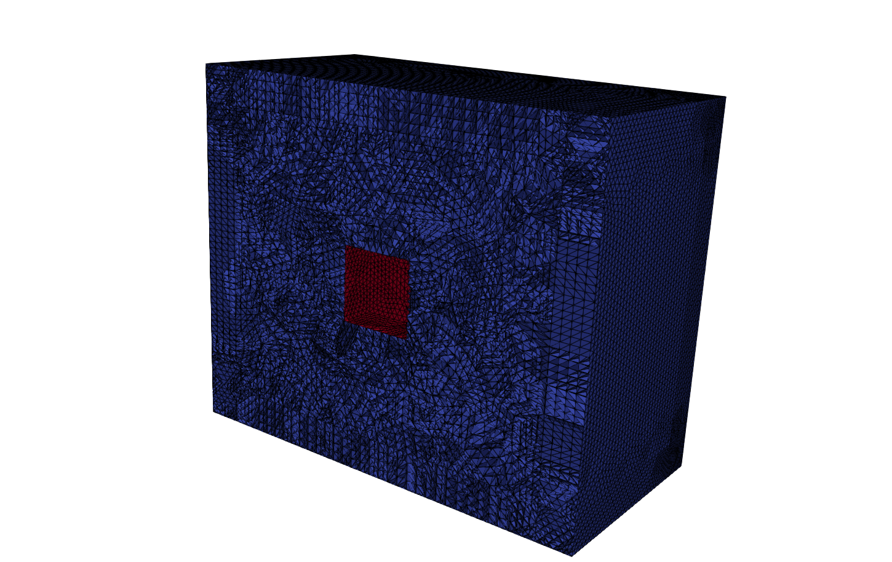
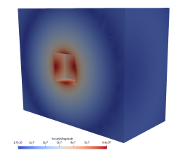
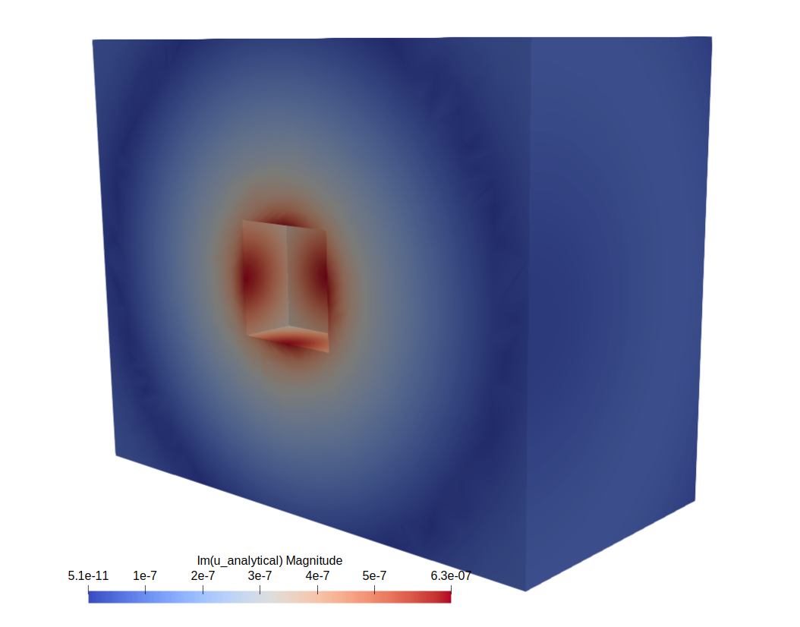
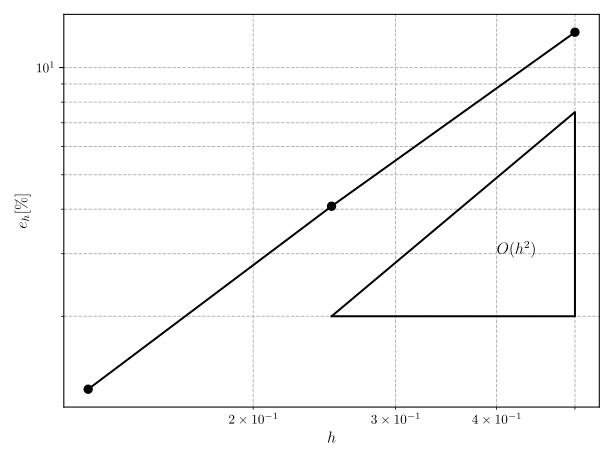

## Benchmark 2

This benchmark tends to check the capablities of Gridap to solve a 3D open-domain acoustic problem by solving a test which its analytical solution is known and, moreover, it shows the process of mesh a simple `.brep` geometry which can be downladed from [BrepFile](https://numseahy.udc.es/index.php/s/LXqenEr6mjSN2FE) using `Gmsh`. The problem solved consists in a monopole emiting sound waves in a 3D space, where the generated field has been evaluated on the trace of a cube and imposed as a boundary condition, having in this way an equivalent problem.


<p align="center">
  
   
</p>


The  mathematical equations that dictates the physical behaviour of this problem are the following ones:


$$
\left\\{
\begin{array}{l}
-\omega^2 \rho_{\mathrm{F}}J \boldsymbol{U} - \rho_{\mathrm{F}}c_{\mathrm{F}}^2\mathrm{div}\left(JH^{-T}\left(H^{-1}:\nabla\boldsymbol{U}\right)\right) = \boldsymbol{0} \qquad  &\text{in } \Omega_{\mathrm{F}} \cup \Omega_{\mathrm{PML}},\\ 
-\rho_{\mathrm{F}} c_{\mathrm{F}}^2 \mathrm{div} \boldsymbol{U}\_{\mathrm{F}} = \Pi_0(x) \qquad  &\text{on } \Gamma_\mathrm{S}, \\
\boldsymbol{U}\cdot \boldsymbol{n} = 0 \qquad  &\text{on } \Gamma_\mathrm{PML}.
\end{array}
\right. 
$$

where $\Pi_0(x)$ is the monopole emitted field. 

The problem is fully parameterised, so use the `Configuration.jl` file to introduce the desire parameters. The `Mesh.jl` file has inside a `FunMesh` function the let generate meshes with different number of elements `N` per wavelength and then save the meshes into the `data` folder. The `Run.jl` file has inside the `RunFEM` function that takes as input the mesh name and run the finite element simulation by using Gridap. Inside the file a convergence test cis performed by using the meshes generated with the `FunMesh` function inside the `Mesh.jl` file. In the following image, the numerical solution contour (left) is compared with the analytical solution (right), showing an excellent match between both solutions:

<p align="center">
  
   
</p>

Because the Gsmh refinement algorithm performs more uniform with planar geometries (unlike the geometry of the Benchmark 1, which is a sphere), the mesh size each time that the refine algorithm is applied is exactly divided by 2, and therefore the convergence analysis is much more uniform and reperesentative. Hence the order of convergence of the numerical method $O(h^2)$ has been reproduced:

<p align="center">
  
</p>

### How to run

First, define the dimensions of the exterior domain, as well as the PML layer size together with the frequency work and the transducer working pressure using the `Configuration.jl` file.

Once the configuration of the problem is done, execute the `Mesh.jl` file to create each of the meshes used in the the convergence test.

```julia
include("src/Mesh.jl")
```

Next, run the `Run.jl` file to perform the corresponding simulations and generate the `errors.csv` file of the errors associated with each of the meshes execute the simulation file:

```julia
include("src/Run.jl")
```

And finally to generate the plot of the convergence test performed, execute:

```julia
include("src/ConvergencePlot.jl")
```

### Authors
This work has been carried out by Andres Prieto Aneiros (andres.prieto@udc.es) and Pablo Rubial Yáñez (p.rubialy@udc.es) during the work developed in the [NumSeaHy](https://dm.udc.es/m2nica/en/node/157) project.

### License
 <p xmlns:cc="http://creativecommons.org/ns#" >This work is licensed under <a href="http://creativecommons.org/licenses/by/4.0/?ref=chooser-v1" target="_blank" rel="license noopener noreferrer" style="display:inline-block;">CC BY 4.0</a></p> 

