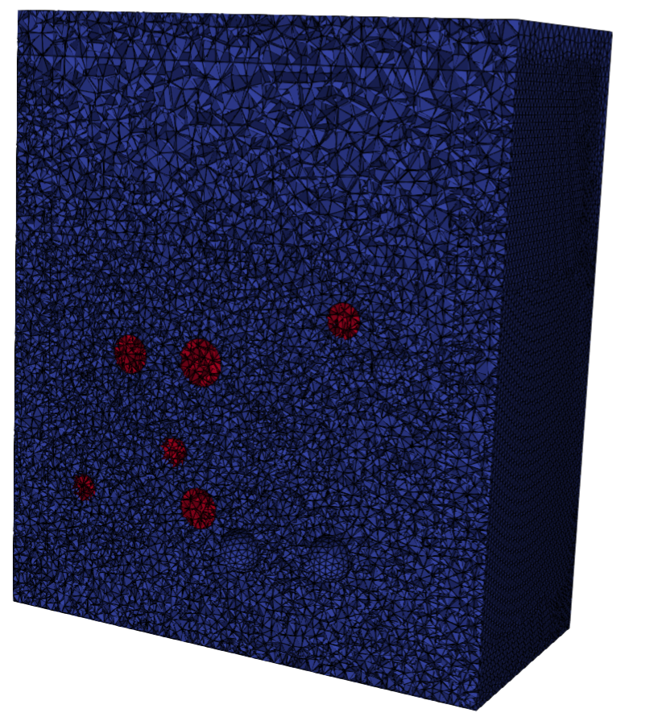
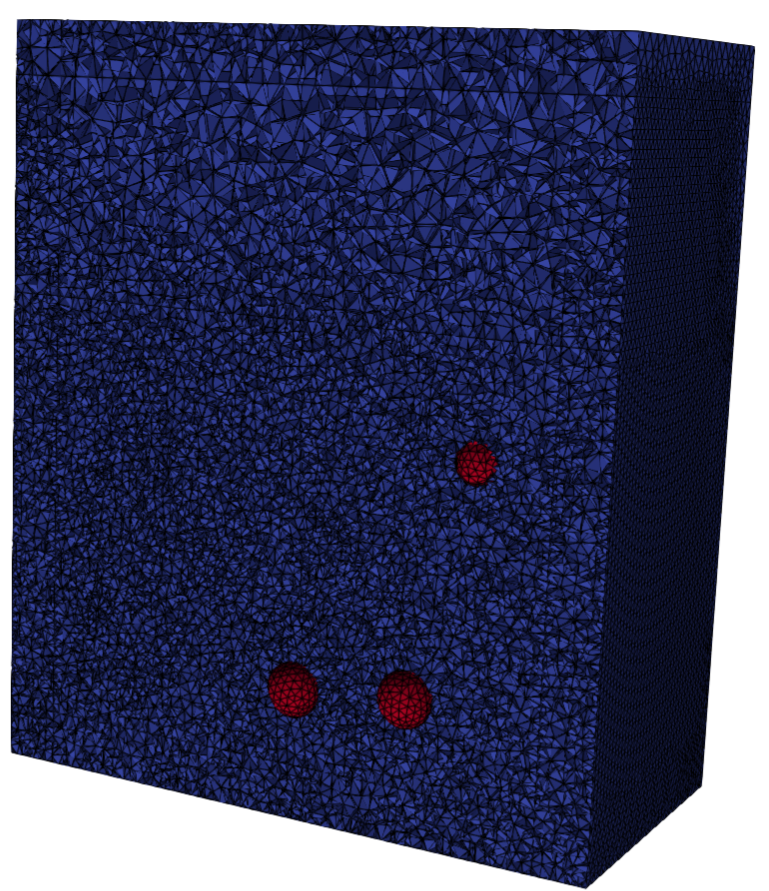

## 3D-Meshing of arbitary number of spherical objects
This repository contains a mesh script that shows the process of how to generate a 3D mesh cotaining a fluid domain and a porous domain surrounded by a PML layer together with several sphere objects which may be rigid or porous. The user select the number of porous and rigid spheres in the `Configuration.jl` file and authomatically the objects are placed randomly inside the porous domain mesh. In the following figure the left image highlights the porous spheres domains included in the domain whereas the right image highlights the boundary rigid speheres included.

<p align="center">
   
   
</p>

The problem is fully parameterised, so use the `Configuration.jl` file to introduce the desire parameters. Those parameters are the following ones:
* $d_{PML}$: to introduce the thickness of the PML layers.
* $L$: to introduce the width of fluid and porous domain.
* $t_P$: to introduce the height of the porous domain.
* $t_F$: to introduce the height of the fluid domain.
* $w$: to introduce the depth of fluid and porous domains.
* Number of rigid spheres: To to intoduce the number of rigid spheres.
* Number of porous speres: To introduce the number of porous spheres.

### How to run
```julia
include("src/Mesh.jl")
```

### Authors
This work has been carried out by Andres Prieto Aneiros (andres.prieto@udc.es) and Pablo Rubial Yáñez (p.rubialy@udc.es) during the work developed in the [NumSeaHy](https://dm.udc.es/m2nica/en/node/157) project.


### License
 <p xmlns:cc="http://creativecommons.org/ns#" >This work is licensed under <a href="http://creativecommons.org/licenses/by/4.0/?ref=chooser-v1" target="_blank" rel="license noopener noreferrer" style="display:inline-block;">CC BY 4.0</a></p> 

